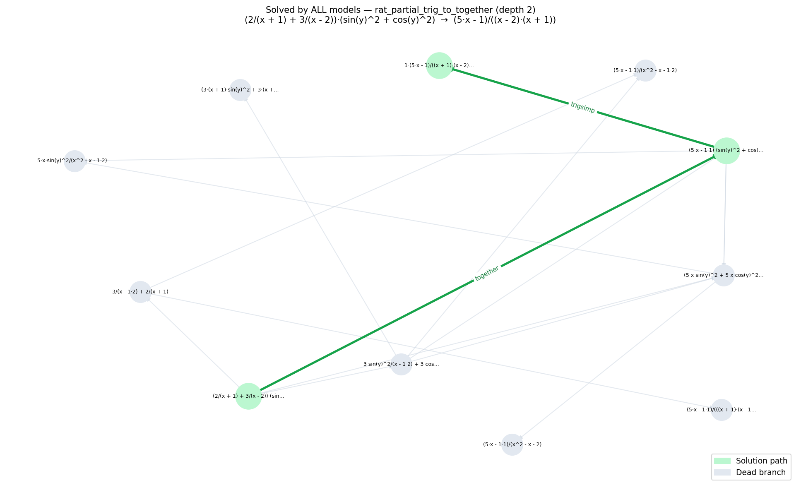
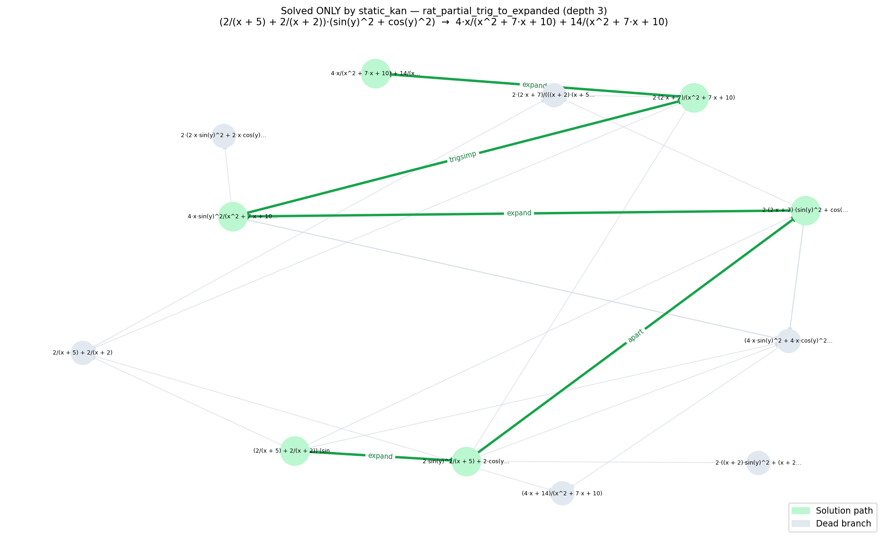
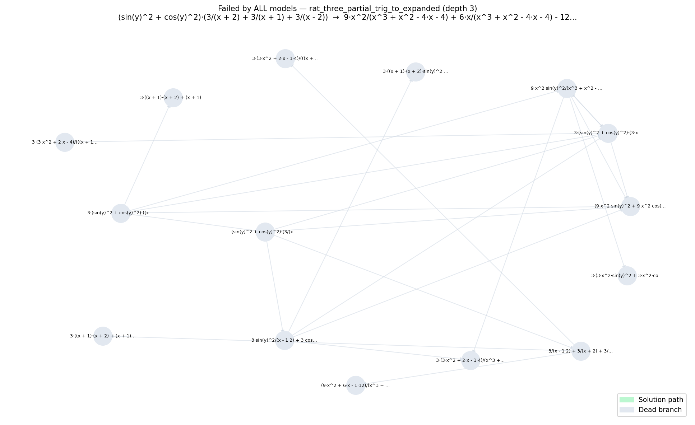
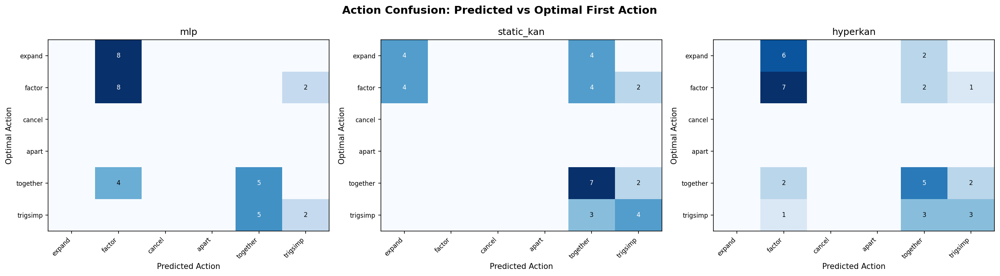
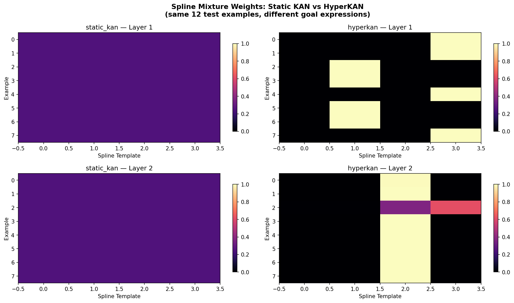
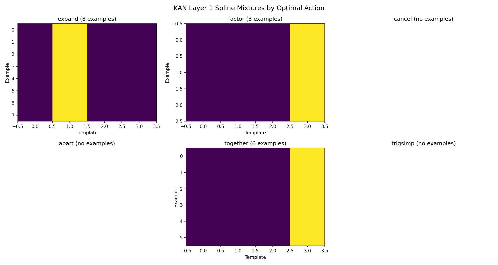
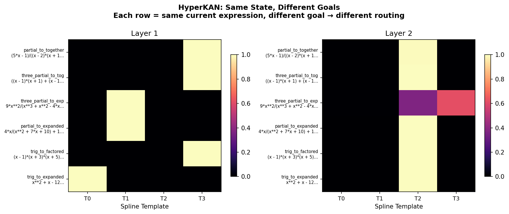
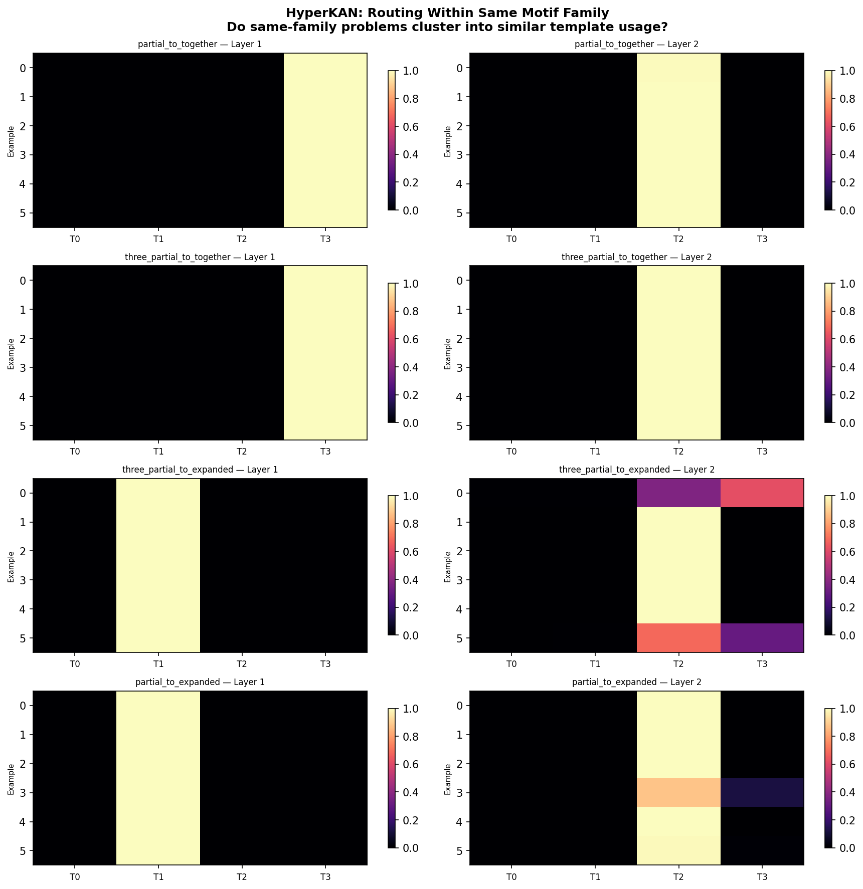
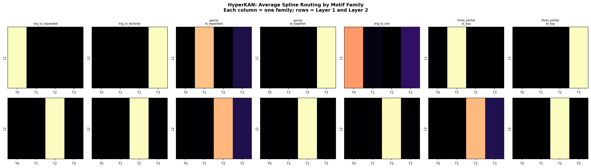
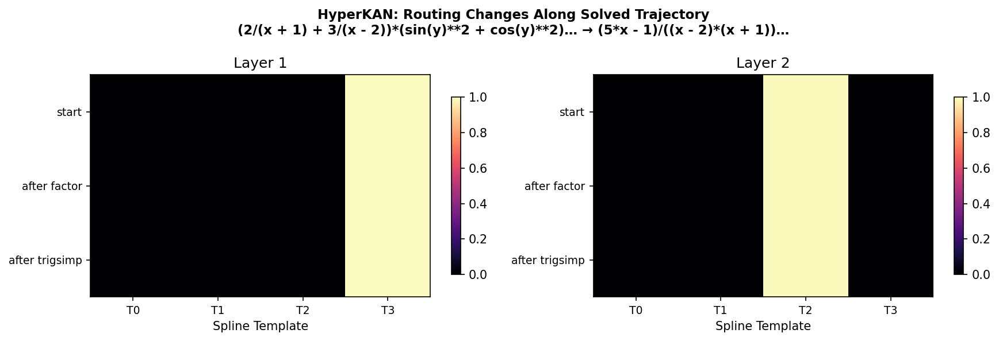

# Mathy — Goal-conditioned HyperKAN for Verified Algebraic Rewriting

> **Branch status:** This README is preserved for the branch historical experiment state. For the frozen submission artifact, use `release/paper-v1` or tag `paper-v1.0`. Later results supersede parts of the branch-local narrative below: the paper story is the moderate-depth frontier-reranker rescue, the depth-7 failure boundary, and negative learned-frontier/RL frontier-controller diagnostics.


> **Mathy** is the project. The repository is **HyperKan**. Run it from wherever you cloned it — the instructions below use `$REPO` as the root.

A local-first POC on Strix Halo (ROCm 7.2) for learning symbolic rewrite policies using KAN architectures.

## What this is

The system learns to rewrite algebraic expressions to a goal form using a set of 6 SymPy actions (`expand`, `factor`, `cancel`, `apart`, `together`, `trigsimp`). A BiGRU encoder reads both the current state and the goal, a policy head scores the 6 actions, and a value head estimates distance to goal. At inference, beam search explores rewrite paths and verifies the result exactly via SymPy.

Three policy heads are compared:
- **MLP** — standard dense baseline
- **Static KAN** — Kolmogorov-Arnold Network with fixed spline templates
- **HyperKAN** — goal-conditioned KAN where a hypernetwork generates spline mixture weights from the goal embedding

## Headline result

On a 274-problem verified test set, Static KAN achieved the best solve rate at **59.5%**, outperforming both MLP (53.6%) and HyperKAN (54.0%). HyperKAN achieved the best supervised validation loss (0.0122 BCE) but did not convert that advantage into better beam-search solving.

## Phase plan

- **Phase 1 (current):** prove the symbolic environment, baselines, and HyperKAN behavior on Strix Halo
- **Phase 2:** promote to H200/B200 only if the local gate passes
- **Phase 3:** multi-GPU only if single-GPU changes the research scope

---

## First real run — results

**Dataset:** 2206 rows, curated motif families, depth 2–3, random 70/15/15 split after exact shortest-path BFS acceptance.  
**Training:** 20 epochs, batch 128, AdamW lr=1e-3, ROCm 7.2, Strix Halo.  
**Eval:** beam-search width 4, max 8 steps, verified by SymPy, **full test set (274 non-terminal problems)**.

### Model comparison


*Full test set, 274 problems.*

Static KAN solves **59.5% (163/274)** of test problems vs 53.6% (147/274) for MLP and 54.0% (148/274) for HyperKAN. Static KAN also uses more solved steps on average (2.28 vs 2.00), consistent with solving cases that require longer trajectories. HyperKAN achieves the lowest supervised loss (0.0122 BCE) but does not convert that into verified search performance.

**What this means:**
- Static KAN outperforms MLP on end-to-end verified search — a real architecture result on this benchmark
- HyperKAN improves label fit but not search behavior — a useful negative, not a failure
- The goal-conditioned routing in HyperKAN is visible in the spline plots but has not yet translated into better solve rates at depth 2–3

### Solve rate by depth


*Depth breakdown on a 15-problem labeled sample from the test set.*

All models solve depth-2 problems perfectly on this sample. The separation appears at depth 3 — only static KAN solves any depth-3 cases here. This is where the architecture difference lives, but the sample is small and this should not be read as a robust depth-3 claim.

### Solve rate by motif family


*Family breakdown on the same evaluable subset. Some families have very few examples — treat 0% and 100% bars with caution.*

All models handle `poly_trig_to_factored`, `rat_partial_trig_to_together`, and `rat_three_partial_trig_to_together` well on this sample. The hard family is `rat_three_partial_trig_to_expanded` — zero solve rate across all models. This requires multi-step rational expansion at depth 3; the current dataset and training are not sufficient.

---

## Trajectory examples

### Solved by all models — `rat_partial_trig_to_together` (depth 2)



`(2/(x+1) + 3/(x-2))·(sin²y + cos²y) → (5x-1)/((x-2)(x+1))`. Green path: `trigsimp` drops the trig identity, then `together` combines the fractions. All three models find this path — it is the easy case where they agree.

### Solved ONLY by static_kan — `rat_partial_trig_to_expanded` (depth 3)



`(2/(x+5) + 2/(x+2))·(sin²y + cos²y) → 4x/(x²+7x+10) + 14/(x²+7x+10)`. A 3-step problem requiring trigsimp, then expand, then apart. MLP and HyperKAN do not find it; static KAN does. The green path shows the solution; gray edges are dead branches the beam explored and abandoned.

### Failed by all models — `rat_three_partial_trig_to_expanded` (depth 3)



A 3-partial-fraction rational expansion problem. All models exhaust the beam without reaching the goal within 8 steps. The gray graph shows the space explored — broad but not reaching the target.

---

## Action confusion



*Predicted vs optimal first action on a 15-problem sample. Small counts — treat patterns as suggestive, not definitive.*

**MLP** — on this sample, often collapses expand/factor decisions and conflates together/trigsimp.

**Static KAN** — directionally cleaner: expand predictions align with expand-optimal cases, together predictions align with together-optimal cases. Some trigsimp confusion remains.

**HyperKAN** — achieves the lowest BCE loss but remains poorly calibrated for first-action prediction on this benchmark. Factor predictions dominate across multiple optimal-action classes, suggesting the model is fitting label correlations rather than the underlying policy.

---

## KAN spline geometry



*Same 8 test examples run through both models.*

**Static KAN** (left) — uses fixed spline templates across all examples by design. That makes it input-invariant in template weights, which is expected by construction. It still produces the best verified solve rate on the current benchmark.

**HyperKAN** (right) — the hypernetwork produces different mixture weights per example. In Layer 1, examples split across two template groups. In Layer 2, individual examples show distinct combinations. This shows active goal-conditioned routing: different goals produce different spline mixture assignments. The routing is sparse (near one-hot rather than smoothly blended) and has not yet translated into better verified solve rates.

### Spline mixtures by optimal action



*Very small per-action sample counts — treat as a diagnostic hint, not a robust result.*

Different optimal actions tend to activate different spline templates in HyperKAN: `expand` activates templates 0–1, while `factor` and `together` both lean on template 3. This partial overlap between factor and together in template space is consistent with the confusion seen in the action calibration plot. Whether this reflects genuine action-specific routing structure or is an artifact of the small dataset is not yet clear.

---

## HyperKAN conditional routing

The hypernetwork in HyperKAN generates spline mixture weights from the goal embedding at inference time. The four plots below probe whether this routing is meaningfully goal-conditioned. HyperKAN shows clear goal- and family-dependent routing patterns, but on the current benchmark those routing differences are more visible across goals and families than across steps within a single solved trajectory.

### Same state, different goals



*Fixed current expression, 6 different goal expressions — one row per goal.*

Each row uses the identical state but a different target. Different template assignments are visible across goals, confirming the routing responds to goal identity rather than state alone. The effect is clearest in Layer 1.

### Routing within a motif family



*Up to 6 instances per family, 4 families shown.*

Some clustering is visible within family blocks — problems from the same family tend toward similar template combinations rather than pure per-sample chaos. The degree of clustering varies by family.

### Average routing per family



*Each column = one family; rows = Layer 1 and Layer 2. Averaged over up to 8 examples per family.*

Averaged routing differs across families: some consistently favor one template, others spread weight across two or three. This is the clearest evidence of family-level structure in the spline routing. Sample counts per family are small, so individual family averages may be brittle.

### Routing along a solved trajectory



*Routing at each step of one beam-search solution (factor → trigsimp).*

For this solved trajectory, routing stays largely stable across steps — Layer 1 stays on the same template, Layer 2 stays on the same template. This suggests the goal-conditioned configuration may dominate over local state changes on this example. Whether dynamic per-step rerouting occurs on harder, longer trajectories is not established here.

---

## Honest conclusions

| Claim | Status |
|-------|--------|
| End-to-end pipeline works on ROCm 7.2 | ✓ proven |
| Static KAN > MLP on verified solve rate | ✓ real result on this benchmark (59.5% vs 53.6%) |
| HyperKAN > static KAN on verified solve rate | ✗ not demonstrated |
| HyperKAN learns goal-conditioned spline routing | ✓ visible in spline plots |
| Goal-conditioned routing improves search at depth 2–3 | ✗ not on current data |

## Limitations

- Dataset is currently depth 2–3 only; depth 4–6 behavior is unknown
- Motif library is narrow (7 families, polynomial and rational forms only)
- Depth and family breakdown plots use small subsets — not the full test set
- HyperKAN routing is active but sparse; the hypernetwork has not been trained with enough depth pressure to make goal-conditioning useful
- 163/274 vs 147/274 is a real difference but not a large margin; results should be confirmed at scale

## Next steps

- Expand motif library to depth 4–6
- Scale to 10k–20k rows
- Re-evaluate HyperKAN under deeper search pressure before drawing architectural conclusions
- Promote to H200/B200 only if local gains hold and depth scaling confirms the result

---

## Layout

```
configs/        config files (local_poc.yaml, toolbox_smoke.yaml, overfit_test.yaml)
data_gen/       symbolic actions, canonicalization, BFS generation, validation
tokenizer/      SReprTokenizer — structural tokenization and vocabulary
models/         BiGRU encoder, MLP, StaticKAN, HyperKAN policy heads
train/          multi-task loss (action BCE + value Huber + entropy), train loop
search/         beam search with verified SymPy rewriting
eval/           end-to-end evaluation entrypoints
viz/            spline mixture and trajectory graph plots
scripts/        run_viz.py, run_full_viz.py, analyze_actions.py, train_local.sh
artifacts/      generated datasets, checkpoints, logs and plots
docs/           visualization outputs committed for README rendering
```

## Running

```bash
# All commands run inside the ROCm 7.2 toolbox
toolbox run -c llama-rocm-7.2 bash -c 'cd $REPO && source scripts/toolbox_env.sh && <command>'

# Generate data (random split for architecture comparison)
python3 -m data_gen.generate_backward --samples 5000 --seed 17 --workers 6 --split-mode random --output-dir artifacts/generated

# Train
python3 -m train.run_experiment --config configs/local_poc.yaml --model-type mlp
python3 -m train.run_experiment --config configs/local_poc.yaml --model-type static_kan
python3 -m train.run_experiment --config configs/local_poc.yaml --model-type hyperkan

# Eval
python3 -m eval.run_verified_eval --dataset artifacts/generated/test.parquet --checkpoint artifacts/checkpoints/hyperkan/best.pt

# Visualize
PYTHONPATH=. python3 scripts/run_full_viz.py
```
