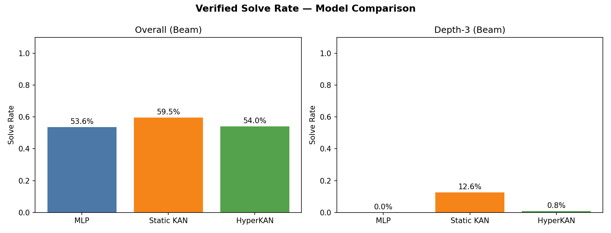
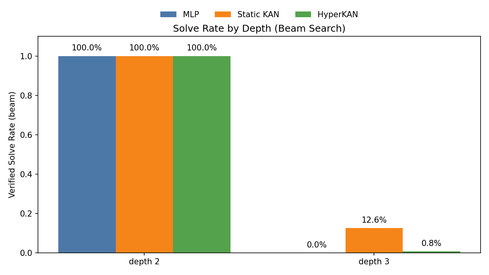
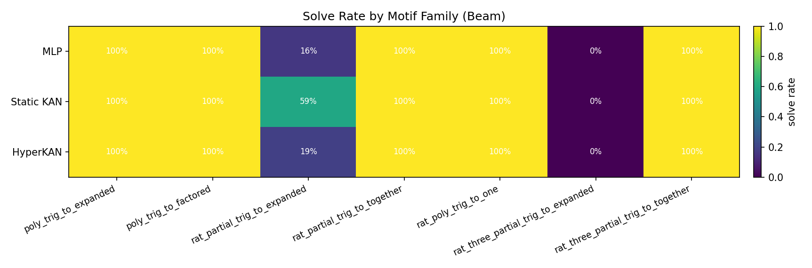
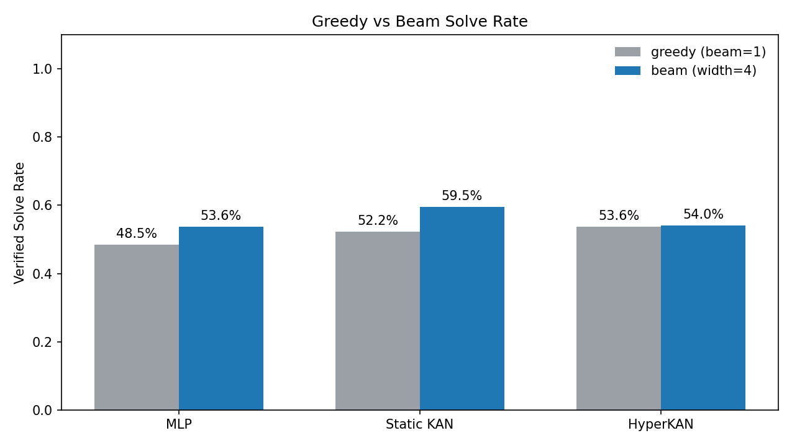

# HyperKan: Verified Symbolic Rewrite Search

This repo trains policy/value models for verified symbolic rewrite search. The original global-action benchmark worked end to end and showed **Static KAN > MLP** on verified solve rate; the initial HyperKAN underperformed, then a reduced-capacity recovered HyperKAN nearly matched Static KAN after ablations. The important follow-up result is that the global SymPy action semantics turned out too shallow for robust depth-4+ composition, so the main branch of the project has moved to **scoped actions**: `action = (site, op)`. Scoped smoke, medium, and diverse guided benchmarks validated the pipeline, but they were too clean to separate models by solve rate. The structural scoped probe is the first benchmark slice with real compositional pressure: seen families are learnable, but default inference fails completely on a held-out mixed composition family. Localization-aware inference rescues recovered HyperKAN at moderate depth, while the depth-7 expansion shows that this rescue does not yet scale cleanly.

## Current Best Results

| Result | Best condition | Outcome |
|---|---|---|
| Global benchmark | Static KAN | `163/274` (`59.5%`) |
| Mixed-family scoped benchmark | Recovered HyperKAN + root penalty `2.0` + frontier reranker | `48/60` beam, `36/60` greedy |
| Key mechanism | Early hidden-branch access | solved beam rows: `36/36` reach `expr@2::cancel` within first 3 actions; unsolved: `12/24` |
| Depth-7 scoped expansion | Recovered HyperKAN + root penalty `2.0` | `18/84` beam; frontier reranker also `18/84` |

## What This Project Is

The task is goal-directed symbolic rewriting with formal execution:

- A model reads a current expression and a target form.
- The policy predicts rewrite actions.
- SymPy executes the selected rewrite.
- Search checks whether the target form is reached.

There are now two benchmark modes:

- **Global actions:** the original six whole-expression SymPy operations: `expand`, `factor`, `cancel`, `apart`, `together`, `trigsimp`.
- **Scoped actions:** the same operator families applied to deterministic sites, serialized as `site::op`, for example `expr@1::factor` or `add_slice@root[0:2]::together`.

The scoped version is not a new model architecture claim. It is a benchmark semantics change: the policy must choose both **where** and **what** to rewrite.

## Global Benchmark Results

The original verified benchmark has 274 non-terminal test problems. Beam search uses width 4 and max 8 steps.

| Model | Beam solves | Solve rate | Depth-3 solves |
|---|---:|---:|---:|
| MLP | 147/274 | 53.6% | 0/127 |
| Static KAN | 163/274 | 59.5% | 16/127 |
| HyperKAN (initial) | 148/274 | 54.0% | 1/127 |

Depth breakdown:

- All models solve depth-2: `147/147`.
- Depth-3 is the only real discriminator:
  - MLP: `0/127`
  - Static KAN: `16/127`
  - HyperKAN: `1/127`

Conclusion: **Static KAN is the best model on the global benchmark**, but the benchmark is effectively shallow. Depth-2 is saturated, and depth-3 is the only separator.

The plots below are from the earlier global-action runs. They remain useful historical diagnostics, but they are not scoped-benchmark results.









## HyperKAN Recovery

The recovery branch tested whether the initial HyperKAN underperformance was a capacity/routing issue rather than a fundamental failure. The best variant was the reduced-capacity HyperKAN:

- Variant: `small_hyper`
- Key change: `hyper_hidden_dim = 64`
- Recovered HyperKAN: `162/274` overall, `15/127` on depth-3
- Static KAN: `163/274` overall, `16/127` on depth-3

Search-temperature calibration did not close the remaining gap. Longer training also did not help reliably: epoch-35 and epoch-50 checks showed verified search can regress even while supervised validation loss improves.

Main takeaway: **search-based checkpoint selection matters**. Supervised validation loss is not sufficient for model selection in this setup.

See [docs/hyperkan_recovery_results.md](docs/hyperkan_recovery_results.md) and `results/hyperkan_recovery/` for details.

## Why We Moved Away From Global Actions

The depth problem stopped being generator guesswork after local graph mining.

Under global actions, isolated ladders exist:

- `block_a_trig_merge_expand` gives a verified depth-3 ladder.
- `block_b_cancel_expand` gives a verified depth-2 ladder.

But naive additive composition under global SymPy rewrites did **not** produce robust depth-4+ families at useful density. Whole-expression rewrites often simplify multiple latent subproblems at once, so composed depth collapses or becomes too hard to verify reliably.

That is why the project moved toward scoped actions.

Relevant files/artifacts:

- [scripts/mine_family_graphs.py](scripts/mine_family_graphs.py)
- [results/composite_family_mining_initial_scan.json](results/composite_family_mining_initial_scan.json)
- [results/global_family_final_bounded_scan.json](results/global_family_final_bounded_scan.json)

## Scoped-Action Benchmark: Current Status

Scoped actions use:

```text
action = (site, op)
```

The current scoped site model uses deterministic subtree path sites plus grouped `Add` slices. Grouped slices were added because normal SymPy `Add` flattening can erase a logical block as a single subtree.

Examples:

- `expr@root::trigsimp`
- `expr@1::factor`
- `numerator@1::expand`
- `denominator@1::factor`
- `add_slice@root[0:2]::together`

Core implementation:

- [data_gen/scoped_actions.py](data_gen/scoped_actions.py)
- [docs/scoped_action_spec.md](docs/scoped_action_spec.md)

Current scoped verification state:

- Strict single-block scoped verification works:
  - block A verifies at depth `3`
  - block B verifies at depth `2`
- Strict composed verification is not yet tractable enough for dataset-scale use.
- Guided first-path composition succeeds for `A3+B1` at scoped depth `4`.
- Strict composed verification and shortest-action tie recovery are still open.

So scoped actions are a live path forward, but this is not the final strict scoped benchmark yet.

## Scoped Guided Milestones

The first scoped datasets were plumbing checks, not the main benchmark claim:

- Smoke `A3+B1`: `24` guided trajectories, both Static KAN and HyperKAN solve `16/16`.
- Medium `A3+B1`: `200` guided trajectories with a held-out coefficient split, both models solve `48/48`.
- Diverse guided: `400` guided trajectories across four action-order families, both models solve `400/400` even with greedy search.

These runs validated scoped dataset generation, scoped action heads, training, checkpointing, and beam eval. They also showed that guided action-order variants were too templated to test compositional generalization by solve rate. That is why the branch moves to structural held-out families instead of scaling these earlier splits.

## Scoped Structural Probe

The structural probe replaces action-order variants with different algebraic mechanisms and holds out a composed family at test time.

Artifacts:

- Dataset: `artifacts/scoped_structural_probe/`
- Config: [configs/scoped_structural_probe.yaml](configs/scoped_structural_probe.yaml)
- Builder: [scripts/build_scoped_structural_dataset.py](scripts/build_scoped_structural_dataset.py)
- Checkpoints/evals: `artifacts/scoped_structural_probe_checkpoints/`

Families:

- `trig_merge`: `trigsimp -> together -> expand`
- `hidden_cancel`: `numerator factor -> cancel -> expand`
- `apart_normalize`: `denominator factor -> apart`
- `mixed_trig_hidden`: trig block plus hidden-factor block in one expression

Split:

- Train/val families: `trig_merge`, `hidden_cancel`, `apart_normalize`
- Test family: `mixed_trig_hidden`
- Dataset size: `48` trajectories, `204` rows, `12` scoped actions

Headline result:

- Search-selected rerun still gives `0/60` on `mixed_trig_hidden` for both Static KAN and recovered HyperKAN by default.
- Failure mode: root-collapse.
  - Static KAN top-1 first action: `expr@root::together`
  - HyperKAN top-1 first action: `expr@root::expand`
- Best mixed-family rescue:
  - Static KAN + root penalty `2.0`: still `0/60`
  - Recovered HyperKAN + root penalty `2.0`: `24/60` greedy, `36/60` beam
  - Recovered HyperKAN + root penalty `2.0` + frontier reranker: `36/60` greedy, `48/60` beam
- Measured mechanism:
  - solved beam rows reaching `expr@2::cancel` within first 3 actions: `36/36`
  - unsolved beam rows reaching `expr@2::cancel` within first 3 actions: `12/24`
- Training-time localization fixes did not replace the inference rescue.
- An earlier hidden-action bonus reduced beam expansions but did not improve solve rate; the later frontier-state reranker improved the shallower mixed-family solve count at a seen-family validation cost.

The detailed structural-probe chain now lives in:

- [docs/scoped_structural_results.md](docs/scoped_structural_results.md)
- [docs/early_frontier_hypothesis.md](docs/early_frontier_hypothesis.md)
- [docs/early_frontier_reranker_results.md](docs/early_frontier_reranker_results.md)

## Scoped Depth Expansion

The depth-expansion branch adds a deeper held-out family, `mixed_trig_hidden_apart`, by composing three structural blocks:

```text
expr@1::trigsimp
add_slice@root[1:3]::together
expr@2::expand
numerator@3::factor
expr@3::cancel
denominator@1::factor
expr@1::apart
```

Artifacts:

- Dataset: `artifacts/scoped_depth_expansion_probe/`
- Config: [configs/scoped_depth_expansion_probe.yaml](configs/scoped_depth_expansion_probe.yaml)
- Results: [docs/scoped_depth_expansion_results.md](docs/scoped_depth_expansion_results.md)

Dataset:

- `48` trajectories
- `228` rows
- `84` non-terminal held-out test attempts
- `14` scoped actions

Held-out depth-7 result:

| Condition | Greedy | Beam 4 |
|---|---:|---:|
| Default | 0/84 | 0/84 |
| Root penalty `2.0` | 0/84 | 18/84 |
| Root penalty `2.0` + frontier reranker | 0/84 | 18/84 |

Failure slice:

- both successful beam conditions solve only the one-action path `expr@1::apart`
- solved rows by guided distance: distance `1` has `9/12`, distance `3` has `9/12`, and distances `2`, `4`, `5`, `6`, `7` all have `0/12`
- the frontier reranker reaches a hidden site within 3 actions on `10/84` rows, but reaches hidden cancel within 3 actions on `0/84`

Conclusion: the moderate-depth rescue is real, but the depth-7 expansion gives a clear failure boundary. The current reranker changes part of the early frontier without turning deeper hidden-cancel access into additional solves.

## One Depth-7 Example

This held-out `mixed_trig_hidden_apart` trajectory shows why the depth-expansion result is a boundary condition rather than a win.

<details>
<summary>Guided depth-7 trajectory from artifacts/scoped_depth_expansion_probe/test.parquet</summary>

Metadata:

- `trajectory_id = mixed_trig_hidden_apart_3`
- `parameter_key = 3_4_3_4__1_2_7__2_3_2_5`
- family: `mixed_trig_hidden_apart`

```text
distance 7
(5*z + 16)/(z**2 + 7*z + 10)
  + (4/(x + 4) + 3/(x + 3))*(sin(y)**2 + cos(y)**2)
  + (z**2 + 9*z + 14)/(((z + 1)*(z + 2)**2))

guided path:
expr@1::trigsimp
add_slice@root[1:3]::together
expr@2::expand
numerator@3::factor
expr@3::cancel
denominator@1::factor
expr@1::apart

goal:
7*x/(x**2 + 7*x + 12)
  + (3/(z + 5) + 2/(z + 2))
  + 24/(x**2 + 7*x + 12)
  + (z + 7)/(((z + 1)*(z + 2)))
```

</details>

Under root-penalized beam search, the solved depth-expansion rows all take only the one-action shortcut `expr@1::apart`. The model does not traverse the full seven-action chain, and the frontier reranker does not fix that.

## Learned Frontier Diagnostic

This local branch also tests whether the heuristic frontier reranker can be replaced by a learned auxiliary frontier head. The head predicts a short-horizon guided frontier target: whether the current guided action reaches the inferred hidden-cancel action within the next 3 guided steps.

This is a negative diagnostic, not a replacement for the main paper result.

What it shows:

- The auxiliary frontier label is learnable.
- The model/head/loss/search wiring works.
- Depth-7 is trainable in-family when `mixed_trig_hidden_apart` rows are present in training.
- The learned frontier score does not rescue held-out depth-7 transfer in the current setup.

In the easy in-family check, default beam already solves all depth-7 test rows:

| Condition | Overall | `mixed_trig_hidden_apart` |
|---|---:|---:|
| Default | `30/34` | `7/7` |
| Learned frontier `0.5`, first 4 steps | `25/34` | `7/7` |

That split is too easy to prove search improvement. A harder curriculum/transfer diagnostic trains on `trig_merge`, `hidden_cancel`, `apart_normalize`, and moderate-depth `mixed_trig_hidden`, then tests on held-out `mixed_trig_hidden_apart`. On the first 12 non-terminal held-out depth-7 attempts:

| Condition | Solves | Mean expansions |
|---|---:|---:|
| Default | `0/12` | `257.17` |
| Root penalty `2.0` | `0/12` | `312.17` |
| Root penalty `2.0` + heuristic frontier reranker | `0/12` | `317.33` |
| Learned frontier `0.05`, first 4 steps | `0/12` | `260.42` |
| Learned frontier `0.1`, first 4 steps | `0/12` | `258.42` |
| Learned frontier `0.25`, first 4 steps | `0/12` | `278.58` |

The same Static KAN transfer diagnostic gives the same broad conclusion:

| Static KAN condition | Solves | Mean expansions |
|---|---:|---:|
| Default | `0/12` | `296.83` |
| Root penalty `2.0` | `0/12` | `327.75` |
| Root penalty `2.0` + heuristic frontier reranker | `1/12` | `314.08` |
| Learned frontier `0.05`, first 4 steps | `0/12` | `306.50` |
| Learned frontier `0.1`, first 4 steps | `0/12` | `305.92` |
| Learned frontier `0.25`, first 4 steps | `0/12` | `293.67` |

Conclusion: the learned frontier head can fit the local supervision target in both recovered HyperKAN and Static KAN, but this target is not enough to solve the depth-7 transfer problem. Static KAN's heuristic reranker gets one shallow solve on this diagnostic slice; the learned frontier score does not. This result should stay as a negative appendix-style diagnostic. The main story remains the moderate-depth frontier-reranker rescue and the depth-7 failure boundary.

A follow-up local branch tests a small RL frontier-controller fine-tune: freeze the supervised recovered HyperKAN policy, update only the auxiliary frontier head with a REINFORCE-style solve/expansion reward, and evaluate on the same 12-row transfer slice. This also remains negative: RL frontier `0.1` gives `0/12` with mean expansions `264.17`, compared with `0/12` and `258.42` for the supervised learned-frontier score. This validates the RL plumbing, but not a depth-7 rescue.

## What Is Proven vs Not Yet Proven

Proven:

- The original global benchmark works end to end.
- Static KAN beats MLP on the global benchmark.
- Recovered HyperKAN can nearly match Static KAN on the global benchmark.
- Verified search metrics can diverge from supervised validation loss.
- Scoped action infrastructure works end to end: dataset generation, training, checkpointing, and scoped beam eval.
- Guided scoped trajectories can be trained and solved, but the early guided splits are saturated.
- The structural scoped probe is non-saturated and exposes a real held-out composition gap.
- Root-penalized localization-aware inference is a meaningful official eval condition on the scoped structural probe.
- A factorized site/op HyperKAN head improves seen-family efficiency but still fails `0/60` on held-out mixed composition and preserves the same root-action bias.
- A simple state-conditional localization heuristic preserves seen-family behavior but still fails `0/60` on held-out mixed composition.
- The unconditional rescue on recovered HyperKAN changes the early search frontier, but solved and unsolved rows still share the same penalized top-1 action.
- Early hidden-branch access within the first 3 actions is a real discriminator between solved and unsolved mixed-family beam cases.
- The depth-7 scoped expansion exposes a limit of the current inference-side rescue: root penalty still gives a shallow partial rescue, but the frontier reranker does not improve solve rate.
- A learned auxiliary frontier head can fit the local short-horizon label in recovered HyperKAN and Static KAN, but the current label/score does not rescue the initial depth-7 transfer diagnostic.

Not yet proven:

- Robust strict depth-4+ density under strict scoped verification.
- Shortest-action multi-label tie recovery for composed scoped cases.
- A learned reranker or training-time mechanism that internalizes the inference-side rescue.
- Broader structurally distinct held-out families beyond the current mixed trig/hidden/apart constructions.
- That a simple training-time `expr@root` avoidance loss can replace inference-time localization bias.
- That a basic factorized site/op head is sufficient to teach mixed-family localization or compositional subgoal choice.
- That a simple mixed-signature conditional inference rule can replace the stronger always-on localization bias.
- That the unconditional rescue can be explained by first-step site choice alone.
- That a simple hidden-branch bonus can improve solve count beyond the unconditional-penalty baseline without hurting seen families.
- That the current frontier reranker transfers from moderate-depth mixed composition to full depth-7 traversal.
- That learned frontier supervision, as currently defined, improves held-out depth-7 compositional transfer.

## Next Steps

- Restore stricter composed verification and shortest-action tie recovery.
- If continuing this line, make the learned frontier target more search-aligned than local hidden-cancel reachability.
- Add broader structurally distinct held-out families, not just more rows from the same templates.
- Re-compare recovered HyperKAN vs Static KAN after the deeper-family failure mechanism is better controlled.

## Reproduction

All ROCm training/eval commands should run inside the toolbox:

```bash
toolbox run -c llama-rocm-7.2 bash -c 'cd /home/marcel/Work/Mathy && source scripts/toolbox_env.sh && <command>'
```

Historical scoped smoke/medium/diverse commands live in the earlier docs and config files. The current branch-specific build is the depth-expansion structural probe:

```bash
python3 scripts/build_scoped_structural_dataset.py \
  --samples 48 \
  --split-mode heldout_test_family \
  --families trig_merge hidden_cancel apart_normalize mixed_trig_hidden_apart \
  --output-dir artifacts/scoped_depth_expansion_probe
```

Train the recovered HyperKAN-style model:

```bash
python3 -m train.run_experiment \
  --config configs/scoped_depth_expansion_probe.yaml \
  --model-type hyperkan \
  --output-dir artifacts/scoped_depth_expansion_probe_checkpoints
```

Run the three official held-out inference conditions:

```bash
python3 -m eval.run_scoped_smoke_eval \
  --dataset artifacts/scoped_depth_expansion_probe/test.parquet \
  --checkpoint artifacts/scoped_depth_expansion_probe_checkpoints/hyperkan/hyperkan/epoch_5.pt \
  --action-vocab artifacts/scoped_depth_expansion_probe/scoped_action_vocab.json \
  --output artifacts/scoped_depth_expansion_probe_checkpoints/hyperkan/hyperkan/test_beam4_default.json \
  --beam-width 4 \
  --max-steps 7 \
  --value-weight 0.2

python3 -m eval.run_scoped_smoke_eval \
  --dataset artifacts/scoped_depth_expansion_probe/test.parquet \
  --checkpoint artifacts/scoped_depth_expansion_probe_checkpoints/hyperkan/hyperkan/epoch_5.pt \
  --action-vocab artifacts/scoped_depth_expansion_probe/scoped_action_vocab.json \
  --output artifacts/scoped_depth_expansion_probe_checkpoints/hyperkan/hyperkan/test_beam4_root2.json \
  --beam-width 4 \
  --max-steps 7 \
  --value-weight 0.2 \
  --root-action-penalty 2.0

python3 -m eval.run_scoped_smoke_eval \
  --dataset artifacts/scoped_depth_expansion_probe/test.parquet \
  --checkpoint artifacts/scoped_depth_expansion_probe_checkpoints/hyperkan/hyperkan/epoch_5.pt \
  --action-vocab artifacts/scoped_depth_expansion_probe/scoped_action_vocab.json \
  --output artifacts/scoped_depth_expansion_probe_checkpoints/hyperkan/hyperkan/test_beam4_root2_frontier.json \
  --beam-width 4 \
  --max-steps 7 \
  --value-weight 0.2 \
  --root-action-penalty 2.0 \
  --frontier-bonus 0.5 \
  --frontier-bonus-steps 3 \
  --frontier-bonus-mode hidden_cancel_access
```

Run the branch-specific diagnostic failure-slice analysis. The official aggregate evals are the `test_beam4_*.json` files above; these diagnostic runs replay the path enough to inspect early hidden-branch access.

```bash
python3 scripts/analyze_penalty_rescue_paths.py \
  --dataset artifacts/scoped_depth_expansion_probe/test.parquet \
  --checkpoint artifacts/scoped_depth_expansion_probe_checkpoints/hyperkan/hyperkan/epoch_5.pt \
  --action-vocab artifacts/scoped_depth_expansion_probe/scoped_action_vocab.json \
  --output artifacts/scoped_depth_expansion_probe_checkpoints/hyperkan/hyperkan/depth7_root2_path_analysis.json \
  --beam-width 4 \
  --max-steps 7 \
  --root-penalty 2.0

python3 scripts/analyze_penalty_rescue_paths.py \
  --dataset artifacts/scoped_depth_expansion_probe/test.parquet \
  --checkpoint artifacts/scoped_depth_expansion_probe_checkpoints/hyperkan/hyperkan/epoch_5.pt \
  --action-vocab artifacts/scoped_depth_expansion_probe/scoped_action_vocab.json \
  --output artifacts/scoped_depth_expansion_probe_checkpoints/hyperkan/hyperkan/depth7_root2_frontier_path_analysis.json \
  --beam-width 4 \
  --max-steps 7 \
  --root-penalty 2.0 \
  --frontier-bonus 0.5 \
  --frontier-bonus-steps 3 \
  --frontier-bonus-mode hidden_cancel_access
```

For the original global benchmark and historical plots, see:

- [docs/shallow_benchmark_details.md](docs/shallow_benchmark_details.md)
- [docs/hyperkan_recovery_results.md](docs/hyperkan_recovery_results.md)
- `artifacts/shallow_benchmark_parallel/`
- `results/hyperkan_recovery/`

## Repository Layout

```text
configs/   training configs
data_gen/  symbolic actions, scoped actions, canonicalization, dataset generation
docs/      project notes and historical figures
eval/      verified global eval and scoped smoke/medium eval
models/    BiGRU encoder, MLP, Static KAN, HyperKAN policy heads
results/   graph-mining and recovery summaries
scripts/   dataset builders, graph miners, diagnostics
search/    global and scoped beam search
tokenizer/ structural expression tokenizer
train/     training loop and losses
viz/       historical plotting utilities
```
